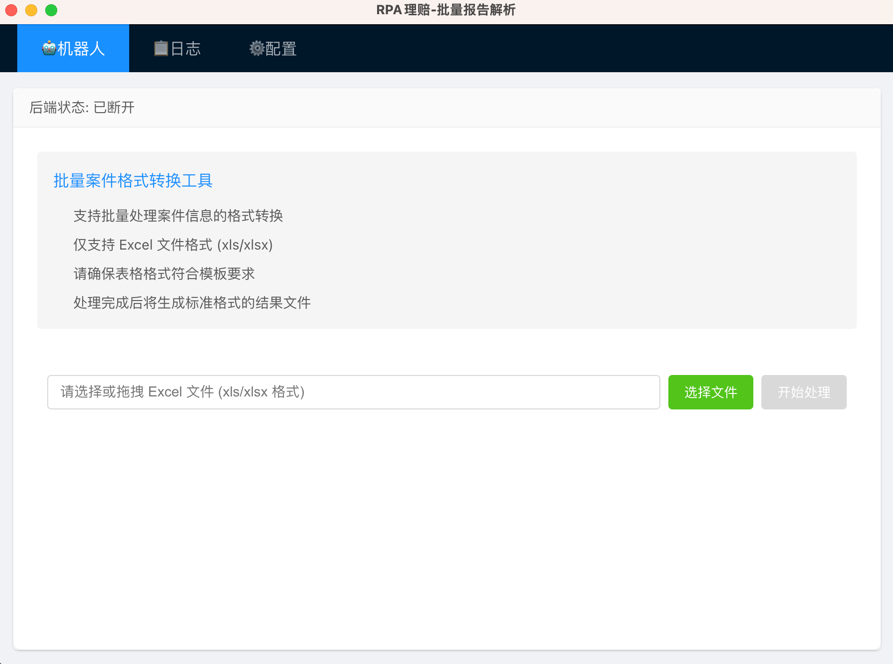
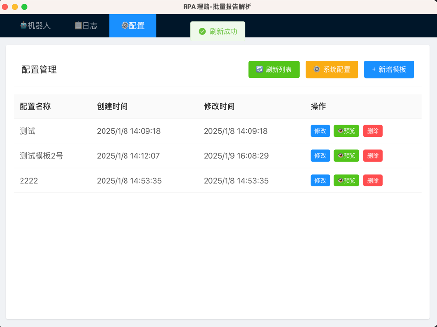

<h1 align="center">electron-app</h1>

<p align="center">An Electron application with Vue3 and TypeScript
Auto Report 是一个基于 Electron 的桌面应用程序，使用 Vue 和 TypeScript 开发。该应用程序旨在提供一个用户友好的界面，用于管理和存储用户数据。用户可以通过简单的 API 端点进行数据的创建、读取、更新和删除操作。
</p>


<p align="center">


</p>

<p align='center'>


</p>

## 功能

- **数据管理**: 用户可以创建、读取、更新和删除数据。
- **用户友好的界面**: 提供直观的界面，方便用户进行数据操作。
- **API 支持**: 通过 RESTful API 进行数据交互，支持 JSON 格式。
- **多平台支持**: 支持 Windows、macOS 和 Linux 平台的打包和运行。

## 项目结构

```
├── build                  # 打包相关资源
├── docs                   # 文档
│   └── dataapi.md         # API 端点文档
├── src                    # 源代码
│   ├── main               # 主进程代码
│   ├── renderer           # 渲染进程代码
│   └── components         # Vue 组件
├── .gitignore             # Git 忽略文件
├── electron-builder.yml    # Electron 打包配置
├── package.json           # 项目配置文件
└── README.md              # 项目说明文件
```

## API 端点

### 1. 创建数据

- **URL:** `/api/savedata`
- **方法:** `POST`
- **请求体:**

  ```json
  {
      "name": "测试",
      "mappings": [
          {
              "templateField": "姓名",
              "userField": "姓名"
          },
          {
              "templateField": "身份证号",
              "userField": "身份证号"
          }
      ]
  }
  ```

- **响应:**

  - **成功:** 状态码 `201`
    ```json
    {
        "message": "数据添加成功！",
        "data": {
            "_id": "自动生成的唯一ID",
            "created_at": "创建时间",
            "updated_at": "修改时间",
            "name": "测试",
            "mappings": [...]
        }
    }
    ```
  - **失败:** 状态码 `500`
    ```json
    {
        "error": "错误信息"
    }
    ```

### 2. 获取所有数据

- **URL:** `/api/data`
- **方法:** `GET`
- **响应:**

  - **成功:** 状态码 `200`
    ```json
    [
        {
            "_id": "b26204ad-1320-4010-89b8-dfa27687c24e",
            "created_at": "2025-01-06T14:36:40.560088",
            "updated_at": "2025-01-06T14:36:40.560267",
            "name": "测试",
            "mappings": [...]
        },
        ...
    ]
    ```
  - **失败:** 状态码 `500`
    ```json
    {
        "error": "错误信息"
    }
    ```

### 3. 获取单条数据

- **URL:** `/api/data/<string:data_id>`
- **方法:** `GET`
- **响应:**

  - **成功:** 状态码 `200`
    ```json
    {
        "_id": "b26204ad-1320-4010-89b8-dfa27687c24e",
        "created_at": "2025-01-06T14:36:40.560088",
        "updated_at": "2025-01-06T14:36:40.560267",
        "name": "测试",
        "mappings": [...]
    }
    ```
  - **未找到:** 状态码 `404`
    ```json
    {
        "error": "未找到数据"
    }
    ```
  - **失败:** 状态码 `500`
    ```json
    {
        "error": "错误信息"
    }
    ```

### 4. 更新数据

- **URL:** `/api/data`
- **方法:** `POST`
- **请求体:**

  ```json
  {
      "_id": "b26204ad-1320-4010-89b8-dfa27687c24e",
      "name": "更新后的名称",
      "mappings": [...]
  }
  ```

- **响应:**

  - **成功:** 状态码 `200`
    ```json
    {
        "message": "数据更新成功"
    }
    ```
  - **未找到或更新失败:** 状态码 `404`
    ```json
    {
        "error": "数据未找到或更新失败"
    }
    ```
  - **失败:** 状态码 `500`
    ```json
    {
        "error": "错误信息"
    }
    ```

### 5. 删除数据

- **URL:** `/api/data/delete`
- **方法:** `POST`
- **请求体:**

  ```json
  {
      "_id": "b26204ad-1320-4010-89b8-dfa27687c24e"
  }
  ```

- **响应:**

  - **成功:** 状态码 `200`
    ```json
    {
        "message": "数据删除成功"
    }
    ```
  - **未找到或删除失败:** 状态码 `404`
    ```json
    {
        "error": "数据未找到或删除失败"
    }
    ```
  - **失败:** 状态码 `500`
    ```json
    {
        "error": "错误信息"
    }
    ```

## Recommended IDE Setup

- [VSCode](https://code.visualstudio.com/) + [ESLint](https://marketplace.visualstudio.com/items?itemName=dbaeumer.vscode-eslint) + [Prettier](https://marketplace.visualstudio.com/items?itemName=esbenp.prettier-vscode) + [Volar](https://marketplace.visualstudio.com/items?itemName=Vue.volar) + [TypeScript Vue Plugin (Volar)](https://marketplace.visualstudio.com/items?itemName=Vue.vscode-typescript-vue-plugin)

## Project Setup

### Install

```bash
$ npm install
```

### Development

```bash
$ npm run dev
```

### Build

```bash
# For windows
$ npm run build:win

# For macOS
$ npm run build:mac

# For Linux
$ npm run build:linux
```

## 许可证

本项目使用 MIT 许可证，详细信息请查看 LICENSE 文件。
